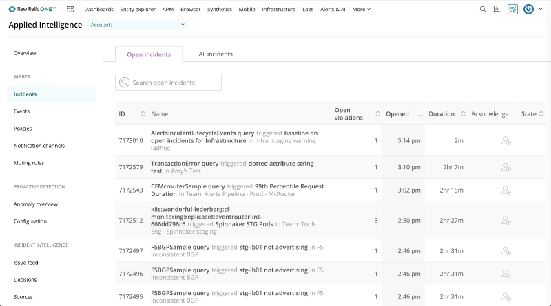

## New Relic

New Relic is an observability platform that helps you build better software integrated into [Nexplayer SDK](https://nexplayer.github.io/TizenWebOS/#/?id=introduction-top) for Tizen, WebOS, Xbox, and PlayStation 5.



## Using with the player

First of all, if you don't have a New Relic account, [sign up](https://newrelic.com/signup).
If you don't have an agent.js file you can follow this [NewRelic documentation](https://docs.newrelic.com/docs/using-new-relic/cross-product-functions/install-configure/configure-new-relic-agents/) to create it.

In order to use it, you need to import these files into the HTML.

```html
  <head>
      <!-- NewRelic browser agent. REMEMBER TO REPLACE THIS SCRIPT WITH YOUR OWN BROWSER AGENT -->
      <script type="text/javascript" src="./agent.js"></script>
      <!-- NewRelic tracker -->
      <script src="https://nexplayer.nexplayersdk.com/NewRelic/newrelic-video-nexplayer.min.js"></script>
      <!-- Nexplayer library -->
      <script src="https://nexplayer.nexplayersdk.com/HTML5/3.3.10_20210614/nexplayer.js"></script>
  </head>
```

Additionally, you should pass in the Setup the useNewRelicTracker property on true.

```js

  nexplayer.Setup({
    key: 'YOUR KEY',
    src: 'VIDEO URL',
    div: document.getElementById('player'),		
    debug: true,
    autoplay: true,
    mutedAtStart: true,
    useNewRelicTracker: true, // Set this property to true in order to use the NR tracker.
    ...
  });

```
