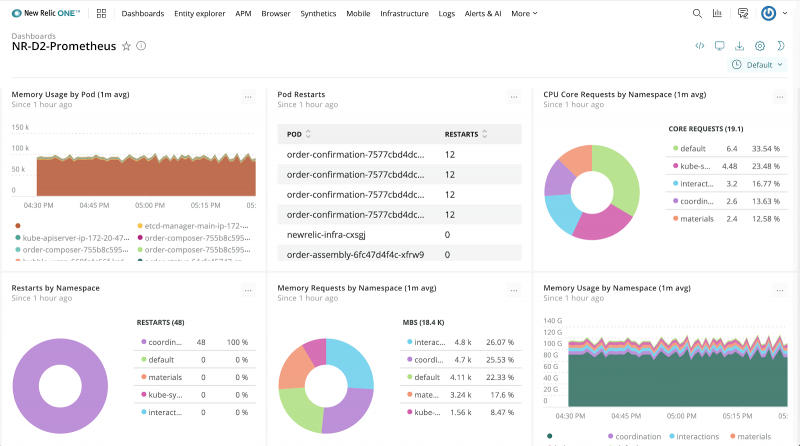

# NexPlayer New Relic

NexPlayer integrates New Relic in Android, iOS & HTML5 Player SDKs, an observability platform that helps you build better software. You can bring in data from any digital source so that you can fully understand your system and how to improve it.

## New Relic features

[Bring all your data together:](https://docs.newrelic.com/docs/using-new-relic/welcome-new-relic/get-started/introduction-new-relic/#bring-your-data) Instrument everything and import data from across your technology stack using New Relic agents, integrations, APIs, and access it from a single UI.

[Analyze your data:](https://docs.newrelic.com/docs/using-new-relic/welcome-new-relic/get-started/introduction-new-relic/#analyze-your-data) Get all your data at your fingertips to find the root causes of problems and optimize your systems. Build dashboards and charts or use New Relic powerful query language.

[Respond to incidents quickly:](https://docs.newrelic.com/docs/using-new-relic/welcome-new-relic/get-started/introduction-new-relic/#respond-faster) New Relic machine learning solution proactively detects and explains anomalies and warns you before they become problems.

## Telemetry Data Platform

New Relic's Telemetry Data Platform is the single source of truth for all your operational data, empowering you to ask and answer any question in milliseconds.

Collect, explore, and alert on all your metrics, events, logs, and traces from any source with the world’s most powerful, managed, open, and unified telemetry platform. Automatic integrations for open-source tools enable easy setup, eliminating the cost and complexities of hosting, operating and managing additional monitoring systems or data stores. With all of your telemetry data in one place, you can investigate your unknowns with confidence.

To use telemetry data and the rest of the [observability platform](https://login.newrelic.com/login?return_to=https%3A%2F%2Fone.newrelic.com%2F), [Sign up](https://newrelic.com/signup) to create your free account.

[More information about New Relic](https://docs.newrelic.com/)

